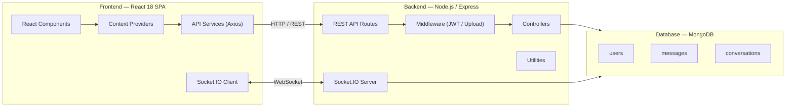
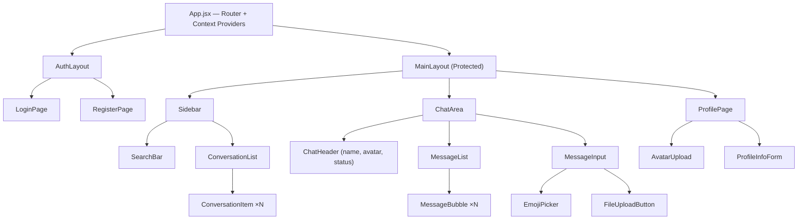
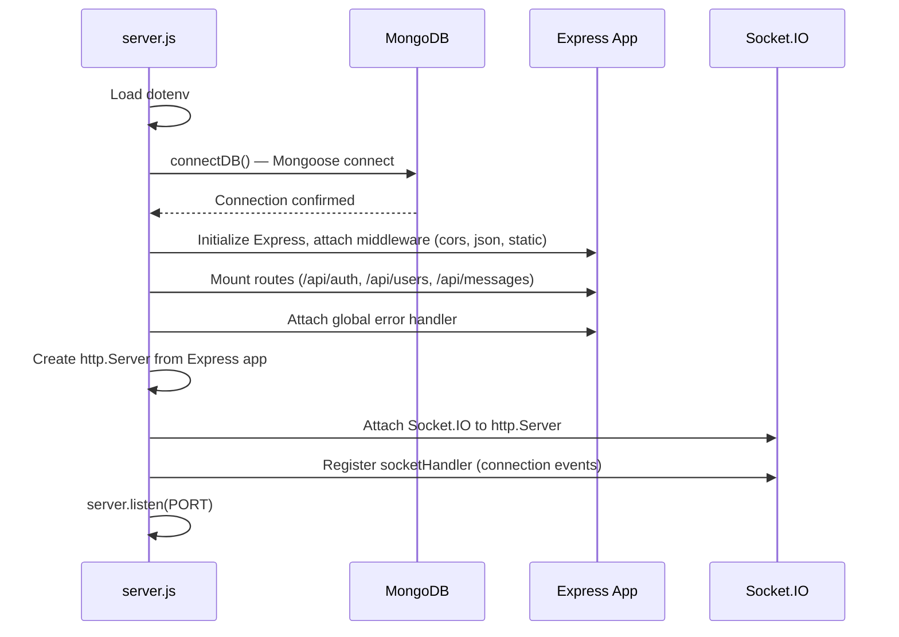
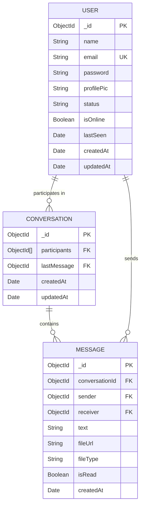
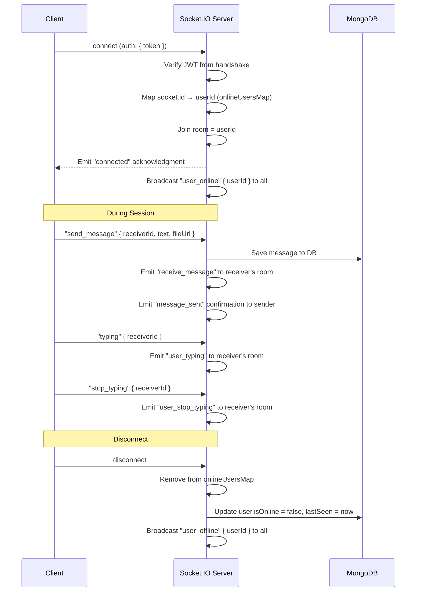
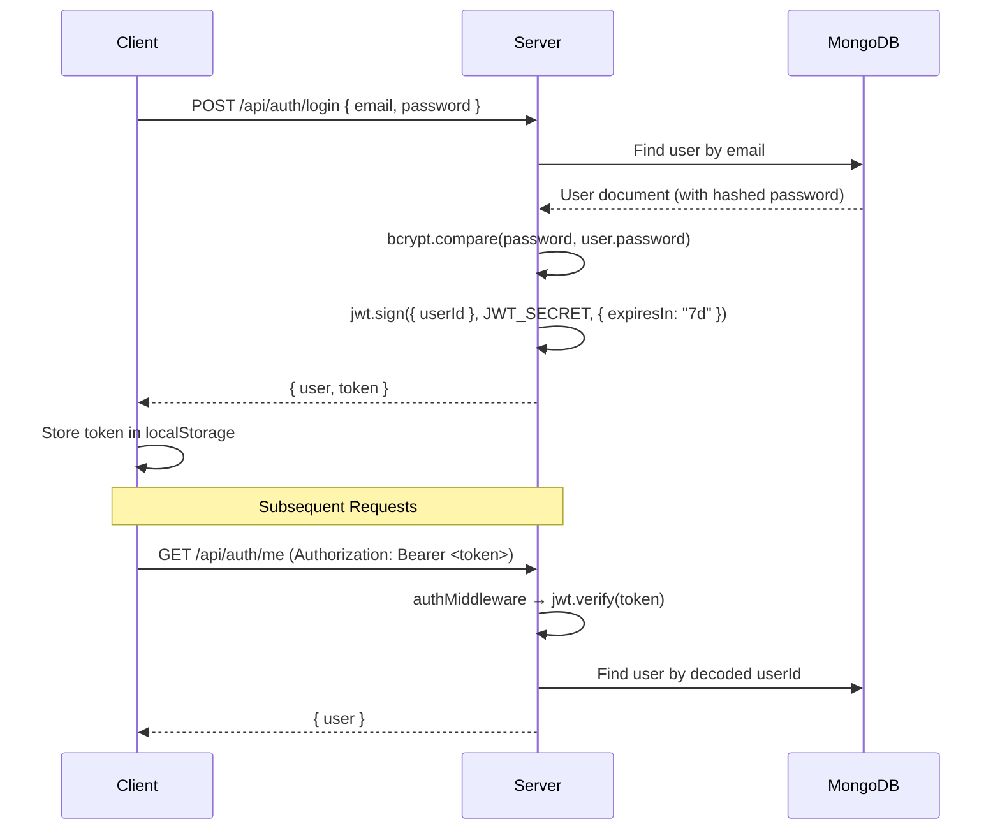
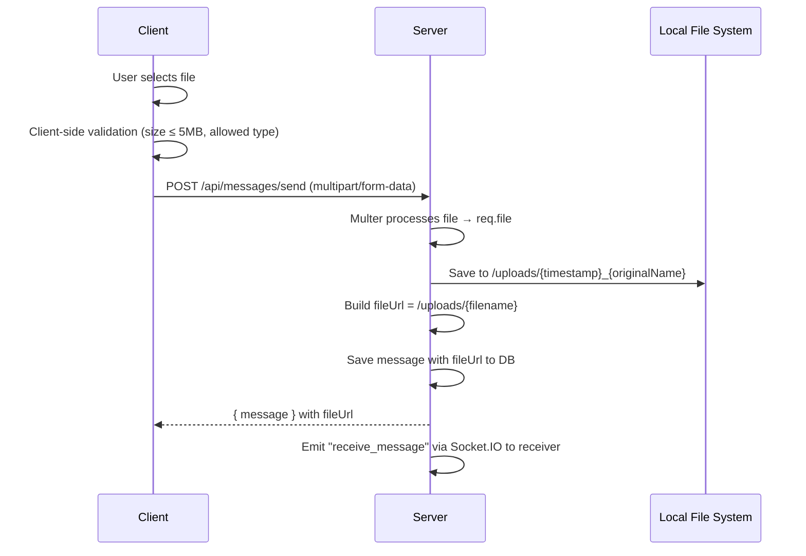
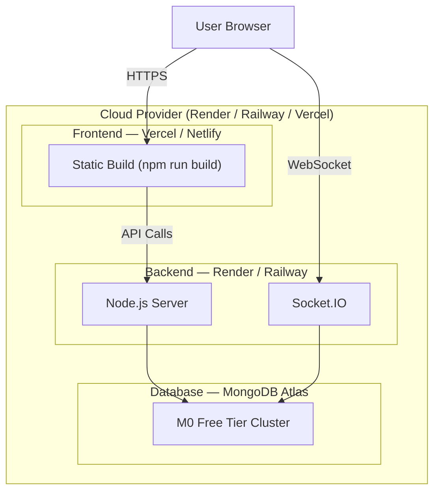
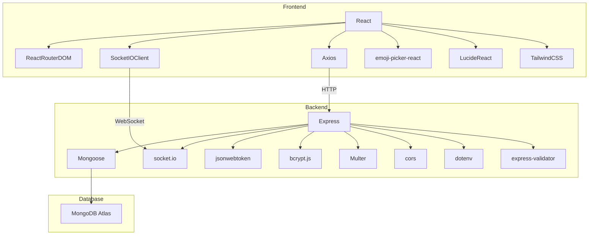

# 🏗️ Architecture Plan — Real-Time Chat Application

> Full-stack system architecture for a modern, real-time messaging platform built with **React 18**, **Node.js / Express**, **MongoDB / Mongoose**, and **Socket.IO**.

---

## 1. High-Level System Overview



### Core Principles

| Principle | Description |
|---|---|
| **Separation of Concerns** | Clean split between client, server, and data layers. Each layer is independently testable. |
| **Event-Driven Real-Time** | Socket.IO enables push-based, bidirectional communication; REST is used only for CRUD operations and auth. |
| **Stateless Authentication** | JWT tokens stored in `httpOnly` cookies (or `localStorage` as a fallback) keep the backend stateless. |
| **Schema-First Data Modeling** | Mongoose schemas enforce data integrity at the application layer before hitting MongoDB. |

---

## 2. Frontend Architecture

### 2.1 Technology Choices

| Concern | Technology | Why |
|---|---|---|
| UI Library | React 18 | Component model, hooks ecosystem, large community |
| Routing | React Router DOM v6 | Declarative, nested routing with loaders |
| State Management | Context API + `useReducer` | Sufficient for auth & chat state; avoids Redux overhead |
| HTTP Client | Axios | Interceptors for JWT, request/response transforms |
| Real-Time | Socket.IO Client v4 | Auto-reconnect, room support, fallback transports |
| Styling | Tailwind CSS v3 | Utility-first, rapid prototyping, responsive design |
| Icons | Lucide React | Lightweight, tree-shakeable icon set |
| Emojis | emoji-picker-react | Drop-in emoji selector component |
| Build Tool | Vite | Fast HMR, native ES modules |

### 2.2 Component Tree



### 2.3 Context Providers (State Layer)

| Context | Responsibilities | Key State |
|---|---|---|
| **AuthContext** | Login, register, logout, persist session, token refresh | `user`, `token`, `isAuthenticated`, `loading` |
| **ChatContext** | Active conversation, message list, unread counts, search results | `conversations`, `activeChat`, `messages`, `unreadMap` |
| **SocketContext** | Connect/disconnect lifecycle, event listeners, emit helpers | `socket`, `onlineUsers`, `typingUsers` |
| **ThemeContext** | Dark/Light mode toggle, persistence to `localStorage` | `theme` |

### 2.4 Routing Map

| Path | Component | Guard |
|---|---|---|
| `/login` | LoginPage | Public only (redirect if authenticated) |
| `/register` | RegisterPage | Public only |
| `/` | ChatDashboard (Sidebar + ChatArea) | Private (redirect to `/login` if unauthenticated) |
| `/profile` | ProfilePage | Private |
| `*` | NotFoundPage | — |

### 2.5 API Service Layer (`services/`)

```
services/
├── api.js             # Axios instance with baseURL, interceptors (attach JWT, handle 401)
├── authService.js     # register(), login(), getMe()
├── userService.js     # searchUsers(), updateProfile()
├── messageService.js  # getMessages(userId), sendMessage(payload)
└── uploadService.js   # uploadFile(formData)  → returns file URL
```

**Axios Interceptor Flow:**

```
Request  →  Attach Authorization header (Bearer <token>)
Response →  If 401 → clear token, redirect to /login
```

---

## 3. Backend Architecture

### 3.1 Technology Choices

| Concern | Technology | Why |
|---|---|---|
| Runtime | Node.js 18+ | Non-blocking I/O, ideal for real-time apps |
| Framework | Express.js v4 | Minimal, middleware-driven, well-documented |
| Real-Time | Socket.IO v4 Server | Rooms, namespaces, automatic reconnection |
| Database ODM | Mongoose v7 | Schema validation, middleware hooks, population |
| Auth Tokens | jsonwebtoken | Industry-standard stateless auth |
| Password Hash | bcrypt.js | Adaptive cost-factor hashing |
| File Upload | Multer | Multipart form-data handling |
| Env Config | dotenv | 12-factor app config |
| Validation | express-validator | Request body/param sanitization |
| CORS | cors | Cross-origin configuration |

### 3.2 Server Directory Structure

```
server/
├── config/
│   ├── db.js                  # Mongoose connection (connectDB)
│   └── config.js              # Centralised env variable exports
│
├── models/
│   ├── User.js                # User schema
│   ├── Message.js             # Message schema
│   └── Conversation.js        # Conversation schema
│
├── controllers/
│   ├── authController.js      # register, login, getMe
│   ├── userController.js      # searchUsers, updateProfile
│   └── messageController.js   # getMessages, sendMessage
│
├── middleware/
│   ├── authMiddleware.js      # JWT verification → req.user
│   ├── uploadMiddleware.js    # Multer config for file uploads
│   └── errorHandler.js        # Global error handling middleware
│
├── routes/
│   ├── authRoutes.js          # /api/auth/*
│   ├── userRoutes.js          # /api/users/*
│   └── messageRoutes.js       # /api/messages/*
│
├── sockets/
│   └── socketHandler.js       # Socket.IO event registration
│
├── utils/
│   ├── generateToken.js       # jwt.sign wrapper
│   └── hashPassword.js        # bcrypt hash/compare helpers
│
├── uploads/                   # Uploaded files (served statically)
├── .env                       # Environment variables
└── server.js                  # Entry point — Express + HTTP + Socket.IO
```

### 3.3 Server Boot Sequence



### 3.4 Middleware Pipeline

```
Incoming Request
    │
    ▼
[ cors() ]                   — Allow requests from CLIENT_URL
    │
    ▼
[ express.json() ]           — Parse JSON request bodies
    │
    ▼
[ express.static('uploads') ] — Serve uploaded files
    │
    ▼
[ Route-specific middleware ]
    ├── authMiddleware.js     — Verify JWT, attach req.user
    └── uploadMiddleware.js   — Handle multipart file uploads
    │
    ▼
[ Controller ]               — Business logic
    │
    ▼
[ errorHandler.js ]          — Catch & format errors → JSON response
```

---

## 4. Database Architecture (MongoDB + Mongoose)

### 4.1 Entity Relationship Diagram



### 4.2 Schema Definitions

#### User Schema

| Field | Type | Constraints | Default |
|---|---|---|---|
| `name` | String | required, trim, minLength: 2 | — |
| `email` | String | required, unique, lowercase, validated | — |
| `password` | String | required, minLength: 6, select: false | — |
| `profilePic` | String | — | `""` (empty = default avatar) |
| `status` | String | maxLength: 140 | `"Hey there! I'm using ChatApp"` |
| `isOnline` | Boolean | — | `false` |
| `lastSeen` | Date | — | `Date.now` |
| `timestamps` | — | Mongoose auto `createdAt`, `updatedAt` | — |

**Pre-save hook:** Hash password with bcrypt (saltRounds = 10) before saving if `password` field is modified.

#### Conversation Schema

| Field | Type | Constraints |
|---|---|---|
| `participants` | [ObjectId] → User | required, validate: exactly 2 for 1:1 |
| `lastMessage` | ObjectId → Message | ref: "Message" |
| `timestamps` | — | Mongoose auto |

**Index:** Compound index on `participants` for fast lookup of existing conversations between two users.

#### Message Schema

| Field | Type | Constraints | Default |
|---|---|---|---|
| `conversationId` | ObjectId → Conversation | required | — |
| `sender` | ObjectId → User | required | — |
| `receiver` | ObjectId → User | required | — |
| `text` | String | — | `""` |
| `fileUrl` | String | — | `""` |
| `fileType` | String | enum: ["image", "video", "document", ""] | `""` |
| `isRead` | Boolean | — | `false` |
| `timestamps` | — | createdAt only | — |

**Index:** Index on `conversationId` + `createdAt` for fast paginated message retrieval.

---

## 5. API Design (RESTful)

### 5.1 Authentication Endpoints

| Method | Endpoint | Body | Response | Auth |
|---|---|---|---|---|
| POST | `/api/auth/register` | `{ name, email, password }` | `{ user, token }` | Public |
| POST | `/api/auth/login` | `{ email, password }` | `{ user, token }` | Public |
| GET | `/api/auth/me` | — | `{ user }` | JWT |

### 5.2 User Endpoints

| Method | Endpoint | Body / Query | Response | Auth |
|---|---|---|---|---|
| GET | `/api/users/search?q=term` | query param `q` | `[ { _id, name, email, profilePic } ]` | JWT |
| PUT | `/api/users/profile` | `FormData { name?, status?, profilePic? }` | `{ updatedUser }` | JWT |

### 5.3 Message Endpoints

| Method | Endpoint | Body | Response | Auth |
|---|---|---|---|---|
| GET | `/api/messages/:userId` | — | `{ conversationId, messages[] }` | JWT |
| POST | `/api/messages/send` | `{ receiverId, text?, fileUrl?, fileType? }` | `{ message }` | JWT |

### 5.4 Standard Error Response Format

```json
{
  "success": false,
  "message": "Human-readable error description",
  "errors": [
    { "field": "email", "message": "Email is already in use" }
  ]
}
```

---

## 6. Real-Time Architecture (Socket.IO)

### 6.1 Connection Lifecycle



### 6.2 Event Catalogue

| Direction | Event Name | Payload | Description |
|---|---|---|---|
| C → S | `send_message` | `{ receiverId, text, fileUrl?, fileType? }` | Client sends a new message |
| S → C | `receive_message` | `{ message }` (full message object) | Server pushes new message to receiver |
| S → C | `message_sent` | `{ message }` | Confirmation + saved message to sender |
| C → S | `typing` | `{ receiverId }` | Client notifies typing started |
| C → S | `stop_typing` | `{ receiverId }` | Client notifies typing stopped |
| S → C | `user_typing` | `{ userId }` | Server notifies receiver that sender is typing |
| S → C | `user_stop_typing` | `{ userId }` | Server notifies receiver that sender stopped typing |
| S → All | `user_online` | `{ userId }` | User came online |
| S → All | `user_offline` | `{ userId, lastSeen }` | User went offline |
| S → C | `unread_count` | `{ senderId, count }` | Updated unread message count |
| C → S | `mark_read` | `{ conversationId }` | Client marks messages as read |

### 6.3 Online Users Map (In-Memory)

```javascript
// server-side in-memory map
const onlineUsers = new Map();  // Map<userId: string, socketId: string>
```

- On `connection`: `onlineUsers.set(userId, socket.id)`
- On `disconnect`: `onlineUsers.delete(userId)`
- To send to specific user: `io.to(onlineUsers.get(receiverId)).emit(...)`

---

## 7. Authentication & Security Architecture

### 7.1 JWT Flow



### 7.2 Security Measures

| Threat | Mitigation |
|---|---|
| Password exposure | bcrypt hashing with salt rounds = 10; `password` field has `select: false` |
| Token theft | 7-day expiry; client-side logout clears token; HTTPS in production |
| XSS | React's default escaping; no `dangerouslySetInnerHTML` usage |
| CSRF | Stateless JWT (no cookies by default); CORS restricted to `CLIENT_URL` |
| Injection | Mongoose parameterized queries (no raw string concatenation); express-validator |
| File upload abuse | Multer file size limit (5 MB); allowed MIME types whitelist |

---

## 8. File Upload Architecture

### 8.1 Upload Flow



### 8.2 Multer Configuration

| Setting | Value |
|---|---|
| Storage | `diskStorage` → `uploads/` directory |
| Filename | `Date.now() + '-' + originalname` |
| File Size Limit | 5 MB |
| Allowed Types | `image/jpeg`, `image/png`, `image/gif`, `image/webp`, `video/mp4`, `application/pdf`, `application/msword` |

---

## 9. Deployment Architecture (Production)



### 9.1 Environment-Specific Config

| Variable | Development | Production |
|---|---|---|
| `PORT` | 5000 | Assigned by host |
| `MONGO_URI` | `mongodb://localhost:27017/chatapp` | MongoDB Atlas URI |
| `JWT_SECRET` | dev-secret | Strong random string (≥32 chars) |
| `CLIENT_URL` | `http://localhost:5173` | `https://your-app.vercel.app` |
| `NODE_ENV` | `development` | `production` |

---

## 10. Non-Functional Requirements

| Attribute | Target | How |
|---|---|---|
| **Latency** | < 100 ms message delivery | Socket.IO direct emit; MongoDB indexed queries |
| **Responsiveness** | Mobile-first, all breakpoints | Tailwind responsive utilities |
| **Accessibility** | WCAG 2.1 AA | Semantic HTML, ARIA labels, keyboard navigation |
| **Performance** | Lighthouse ≥ 85 | Code splitting, lazy loading, optimized images |
| **Scalability** | ~100 concurrent users | Single Node process sufficient for college project |
| **Reliability** | Socket auto-reconnect | Socket.IO built-in reconnection with exponential backoff |

---

## 11. Technology Dependency Map



---

> **This architecture document serves as the single source of truth for the system design. All implementation should adhere to the patterns, schemas, and conventions defined here.**
